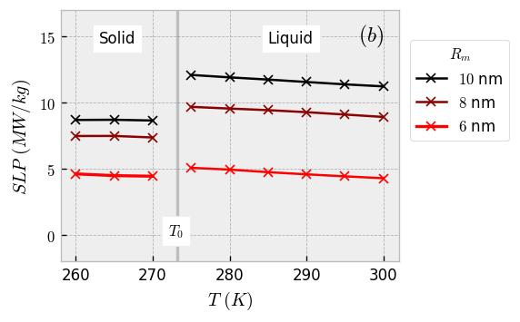

## Data Information

Physical parameters used for simulation:

   
     
\
\
   
  
  
})   
\
       

## Figure Information

Specific Loss Power as a function of temperature for a core radius of 6 nm, $8$ nm and 10 nm. $T_0$ denotes the melting temperature of water.