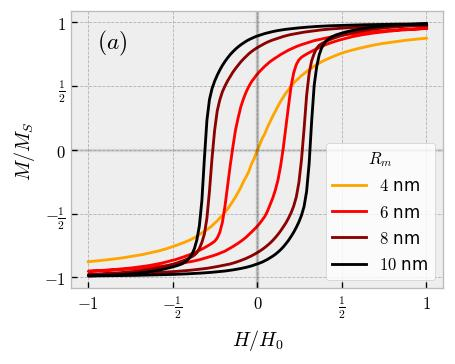

## Data Information

Physical parameters used for simulation:

   
   
\
   
  
    
})   
   
      

## Figure Information

Reduced magnetization as a function of the external magnetic field for different core radius at 300 K.