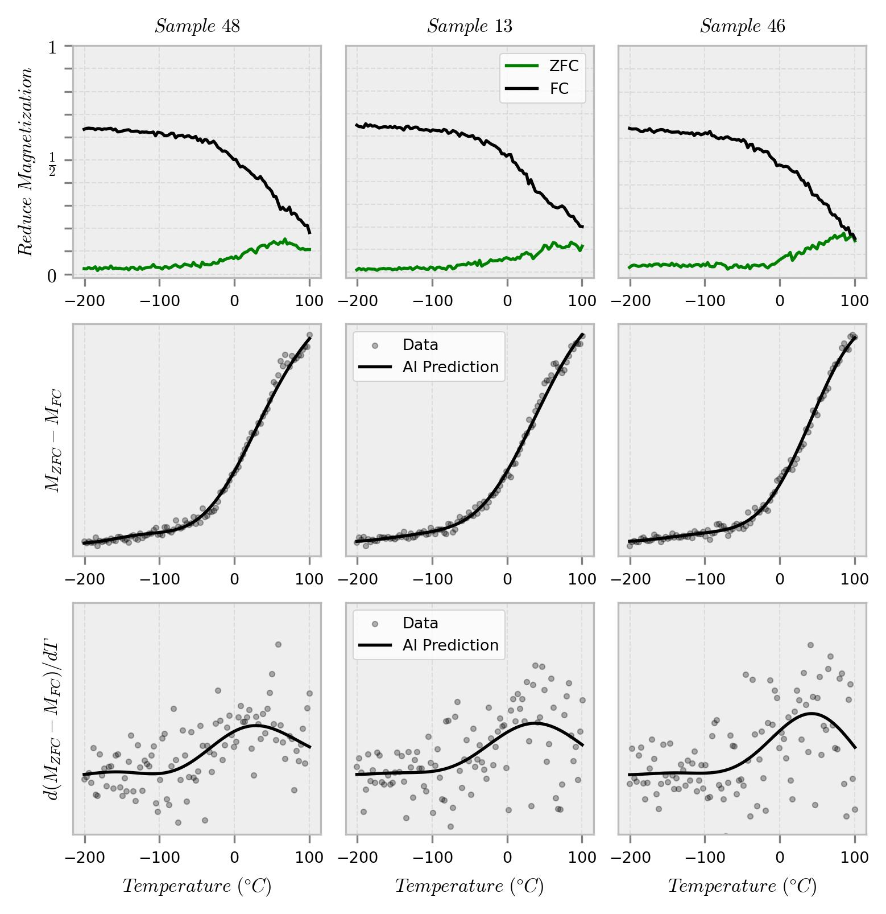
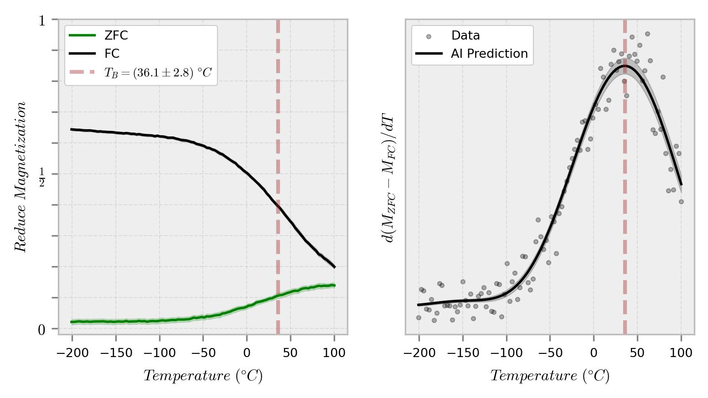

<b>Blocking Temperature and Artificial Intelligence</b>

    In the present work, it is demonstrated how the computational synthesis of materials: magnetic nanoparticles with potential application in magnetic hyperthermia, can be assisted through the use of AI models. Visit <i>./Data/Data</i> for the datasets and <i>./Data/Summary.txt</i> for the physical parameters.

    In Figure 1, Row 1 displays the reduced ZFC and FC magnetizations as functions of temperature for 3 samples. The typical behavior of a system of non-interacting uniaxial magnetic nanoparticles is observed [1-3]. Subsequently, in Row 2, the difference between both magnetizations (gray points) is depicted, and a machine learning model based on SVR [4] (solid line) is implemented in order to illustrate its trend. Finally, in Row 3, the derivative of this difference (both data and AI predictions) is plotted, corresponding to the anisotropy barrier distribution [3].

    The aforementioned process is carried out for all 50 numerical experiments, and the results are averaged, resulting in Figure 2. The peak of the anisotropy barrier distribution (Right Column, Figure 2) corresponds to the blocking temperature (red dashed line). In this study, a value of 36.1 °C has been determined for spherical magnetite nanoparticles. The applicability of cancer treatments via magnetic hyperthermia, based on hysteresis loss energy, necessitates blocking temperatures slightly higher, around 42-45 °C [5-7].

    

    <b>Figure 1.</b> (Row 1) ZFC and FC reduced magnetizations, (Row 2) their difference, and (Row 3) derivative of their difference as a function of temperature.

    

<b>Figure 2.</b> (Left) ZFC and FC reduced magnetizations and (Right) anisotropy barrier distribution as a function of temperature.

#### References

[1] E. del Barco, M. Duran, J. M. Hernandez, J. Tejada, R. D. Zysler, M. Vasquez Mansilla, and D. Fiorani, *[Phys. Rev. B](https://doi.org/10.1103/PhysRevB.65.052404)*, 65, 052404 (2002).   
[2] M. P. Fernández-García, P. Gorria, M. Sevilla, A. B. Fuertes, R. Boada, J. Chaboy, G. Aquilanti, and J. A. Blanco, *[Phys. Chem. Chem. Phys.](https://doi.org/10.1039/C0CP00396D)*, 13, 927-932 (2011).   
[3] I. J. Bruvera, P. Mendoza Zélis, M. P. Calatayud, G. F. Goya, and F. H. Sánchez, *[J. Appl. Phys.](https://doi.org/10.1063/1.4935484)*, 118, 184304 (2015).   
[4] Scikit Learn, *[Support Vector Regression](https://scikit-learn.org/stable/modules/generated/sklearn.svm.SVR.html)*, 2024.    
[5] S. Laurent, S.Dutz, U. O. Häfeli, and M. Mahmoudi, *[Adv. Colloid Interface Sci.](https://doi.org/10.1016/j.cis.2011.04.003)*, 166, 8–23 (2011).    
[6] A. Andrade, R. Ferreira, J. Fabris, and R. Domingues, in Biomedical Engineering—Frontiers and Challenges, 1st ed. (InTech, 2011), p. 157.    
[7] B. E. Kashevsky, S. B. Kashevsky, T. I. Terpinskaya, and V. S. Ulashchik, *[J. Magn. Magn. Mater.](https://doi.org/10.1016/j.jmmm.2018.11.083)*, 475, 216–222 (2019). 