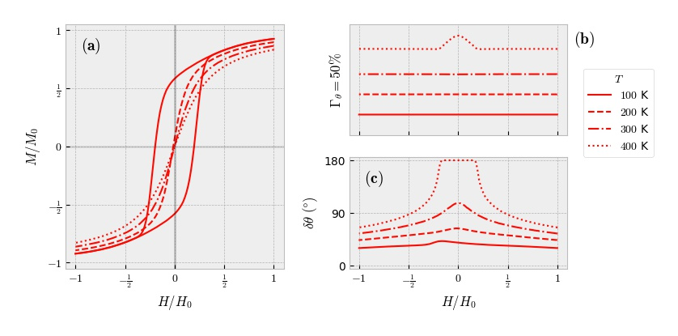

## Data Information

Physical parameters used for simulation:

   
   
   
   
   
})   
})   
    

## Figure Information

Reduced magnetization (**a**), acceptance rate (**b**) and cone aperture (**c**) as a function of the external magnetic field. Blocked and superparamagnetic behaviors are seen according to temperature.