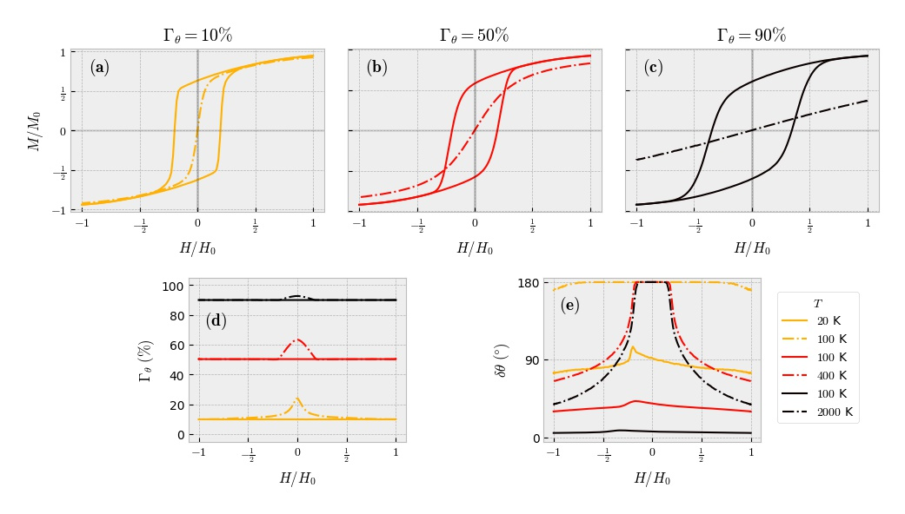

## Data Information

Physical parameters used for simulation:

   
   
   
  
   
})      
})    
    

## Figure Information

Reduced magnetization for percentages of acceptance of 10 (**a**), 50 (**b**) y 90 (**c**), acceptance rate (**d**) and cone aperture (**e**) depending on the external field for different temperature values. At low temperatures there is magnetic hysteresis (solid lines) and at high temperatures a superparmagnetic behavior occurs (discontinue lines).